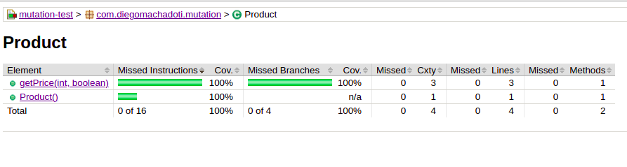

# mutation-test
***Projeto simulando cenários de cobertura de teste unitários e utilização do pitest(teste de mutação) para analise dos testes unitários (efetividade, eficiência e/ou suficientes).*** 

### Exemplo dos cenários para os testes
Uma aplicação onde são vendidos vários produtos seguindo as seguintes regras: 
> Se comprar menos de 10 unidades
> > O valor do produto será 23,00

> Se comprar 10 ou mais unidades
> > O valor do produto será 17,00
 
> Se possuir um cupom de desconto
> > O valor do produto será 17,00

## For running jacoco (Java Code Coverage):
***Biblioteca do java para cobertura de teste***
>> ./gradlew build jacocoTestReport
#### ***build/reports/jacoco***

Rodando coverage dos testes unitários


## For running mutation tests run:
***Ferramenta para realização de testes de mutação***
>> ./gradlew clean pitest
#### ***build/reports/pitest***

Rodando os testes um dos testes de mutação sobreviveu com isso temos um problema no desenvolvimento da funcionalidade ***Product***
- Alterou um dos operadores de ***>*** para ***>=*** e nosso teste não quebrou
  - BUG identificado pois nosso requisito acima informa que o valor do pruduto pode ser maior ou igual a 10
  - Apensar da cobertura dos testes Jacoco estar em 100% o teste  mutaçao encontrou esse problema.
  

### Solução
1. Adicionar um cenário de teste unitário para validar o cenário de produto com valor igual a 10. (O teste vai falar, pois o BUG deve ser corrigido)
```
@Test
    fun `deve retornar preço com desconto por valor = 10`() {
        val product = Product()
        val amount = 10 // igual a 10 sem cupom
        val price = product.getPrice(amount, false)
        Assert.assertEquals(price, 170) // R$ 17x10
    }
```
2. Com isso Devemos corrigir o desenvolvimento da funcionalidade na validação de getPrice ***amount >= 10***

3. Rodar a bateria de teste de mutação novamente

**Nenhum teste de mutação sobreviveu com isso os testes unitários estão eficientes.**

### Analise de Código
Projeto configurado no sonarCloud 
* [Sonar Cloud](https://sonarcloud.io/project/overview?id=diegomachadoti_mutation-test)

### Referência
* [Kotlin](https://kotlinlang.org/)
* [Jacoco](https://www.eclemma.org/jacoco/)
* [Pitest](https://gradle-pitest-plugin.solidsoft.info/)
